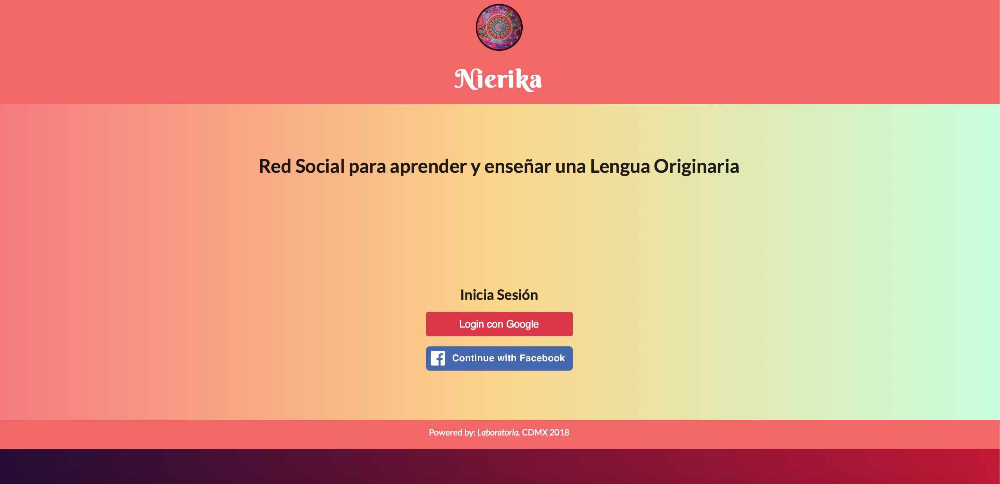

# Nierika

## Red Social para aprender y enseñar una lengua originaria

Para las culturas originarias o indígenas, los colores forman una parte esencial de su comunicación simbólica. La _nierika_ es uno de los conceptos más complejos y difíciles de traducir al español, ya que no contamos con las palabras suficientemente acertadas para poder definir con claridad lo que representa para su cultura, una de las formas más acercadas, según Maria Jose Castañedaen [Nierika o el espejo transgeneracional de los wixarikas _huicholes_](https://masdemx.com/2015/12/nierika-o-el-espejo-transgeneracional-de-los-wirrarikas-huicholes/) nierika, entre otras definiciones simbólicas, un espejo en el que el pasado y el presente colindan, para los wixarikas, (_huicholes_) por lo que su deifinición inspira el nombre de esta aplicación web, que pretende, mediante un método moderno, como lo es la tecnología web, recuperar y preservar el pasado y presente lingüístico de nuestros pueblos originarios.
 [Image from **Indigo Arts**](https://indigoarts.com/galleries/nierika-yarn-paintings-huichol-indians-mexico)

Derivado de la gran importancia que tiene el simbolismo para los usuarios principales de esta red social: **hablantes de lenguas indígenas**, se ha seleccionado uno de los animales más representativos como una visión llamativa de bienvenida, el lobo mexicano.

El lobo mexicano tiene no sólo en común una identidad originaria con los pueblos indígenas, si no que comparte la dura realidad de enfrentarse a la extinción. Como símbolo de la resistencia, aún frente a la extinción, el lobo mexicano fuerte y corriendo, representa la fuerza para la acción que se emprende, en este caso, resistir a la extinción de las lenguas originarias.

## Objetivo

Este proyecto tiene como objetivo colaborar con la preservación, uso y didáctica de las lenguas originarias de México.

## Justificación

Debido a la unificación del español de México como lengua oficial del país, las lenguas originarias o denominadas "Lenguas Indígenas" se han ido extinguiendo a una velocidad que parece aumentar, _64 de 68 lenguas indígenas de nuestro país se encuentran en peligro de desaparecer en los próximos años_. Posiblemente, el uso de la tecnología podría aportar a la preservación de las lenguas originarias promoviendo su aprendizaje y contribución pública para formar un corpus inmenso que permita la preservación de la palabra indígena en múltiples medios: video, foto y texto. [Preguntas frecuentes sobre Lenguas en Peligro de Extinción, UNESCO](http://www.unesco.org/new/es/culture/themes/endangered-languages/faq-on-endangered-languages/)

Según,Martín Bonfil Oliver "México forma parte del grupo de ocho países en los que se concentra la mitad de las lenguas que se hablan en el mundo, pero desde la Conquista
se calcula que se han perdido cuando menos 100.", [Revista Cómo Ves, No. 113](http://www.comoves.unam.mx/assets/revista/113/ojodemosca_113.pdf)

La importancia de la preservación de los diversos lenguajes que se han utilizado en el mundo por diversas culturas, fue determinado por la UNESCO "Todo idioma refleja una visión del mundo única en su género, con su propio sistema de valores, su filosofía específica y sus características culturales peculiares. Su extinción supone una pérdida irrecuperable de los conocimientos culturales únicos que se han ido encarnando en él a lo largo de los siglos. Entre ellos figuran algunos de índole histórica, espiritual y ecológica que pueden ser esenciales no sólo para la supervivencia de sus hablantes, sino también para las de un número incalculable de personas. La lengua es una fuente de creación y un vector de la tradición para la comunidad de sus hablantes." [UNESCO, Lenguas en peligro.](http://www.unesco.org/new/es/culture/themes/endangered-languages/faq-on-endangered-languages/)

## Funcionalidad y próximos alcances

Este proyecto pretende tener un alcance internacional. Permitir a los usuarios filtrar publicaciones por lengua y locación, guardar post y enviar al correo. Del mismo modo pretende obtener datos más complejos de entrada:
**Una entrada para contenido multimedia: imágenes, video y audio.**
**Un selector por localidad de las 68 lenguas indigenas y sus variantes regionales.**
**Un input opcional para el usuario para agregar una traducción propia en español.**
**Un servicio de geolocalización opcional para detectar automáticamente la variante regional del usuario.**
**Login con Twitter**, es necesario que se tenga una cuenta de correo de google, una cuenta de Facebook para ingresar a la red, por motivo de seguridad y validación de la identidad, sólo medinte estas tres redes se podrá acceder a esta red, a menos, que en el futuro un nuevo análisis lo requiera, se abrirá la opcón de ingreso con cuenta de correo.
Un tipo de perfil: **A. HABLANTE B.APRENDIZ C. INVESTIGADOR** a elegir por la lengua que el usuario seleccione para que aparezca en su perfil, además de que comparta una pequeña biografía.
**Conexión entre usuarios.** Los Usiarios podrán conectarse entre sí mediante Mis Amigos, intercambiar mensajes privados.
**La función guardar y compartir** Los usuarios podrán enviar por correo o compartir en las principales redes sociales los posts del TimeLine.
**Buscador por palabra, tema, variante regional o lengua originaria** El filtro en la búsqueda permitirá a los usuarios interactuar de una manera más fluida en el contenido de los post.

Se pretende una vez que se tenga un _corpus_ para comenzar, permitir a los investigadores mediante el pefil **C. INVESTIGADOR** en su perfil, y la especificación de su campo y objetivo de estudio, (así como la aceptación de las condiciones de uso, propiedad intelectual y privacidad de los usuarios **A. HABLANTES**) la visión completa del origen de los post por localidad y variante regional generados.

## Uso e instalación

Para acceder a la Red Social se necesita un navegador web (firefox, Google o Safari en una versión no anterior a 2015) No se requiere instalación adicional. Para hacer Login, se requiere de una cuenta en Google o Facebook o, posteriormente mediante Twitter.
Una vez el login sea exitoso, el usuario obtendrá la visión del TimeLine y tendrá la posibilidad de publicar.
